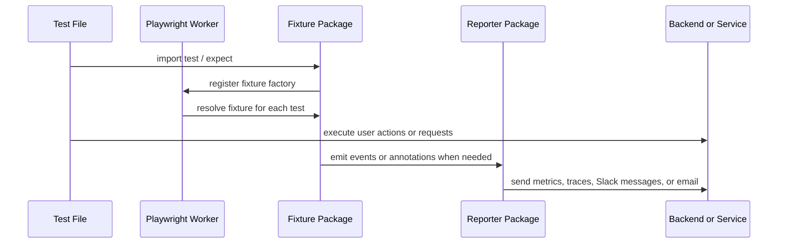

Playwright Labs is organized as a set of package families instead of a single runtime. The important architectural decision is that each family stays close to the part of Playwright it extends: test-scoped behavior lives in fixtures, run-scoped behavior lives in reporters, browser-side behavior lives inside selector engines, and type-driven editor behavior lives in the TypeScript plugin packages.

```mermaid
graph TD
  A[@playwright/test] --> B[Fixture packages]
  A --> C[Reporter packages]
  B --> D[Worker runtime]
  C --> E[Reporter process]
  D --> F[stdout event bridge]
  F --> E
  G[selectors-core parser] --> H[selectors-react]
  G --> I[selectors-vue]
  G --> J[selectors-angular]
  K[sql-core] --> L[fixture-sql]
  K --> M[ts-plugin-sql]
  N[otel-core] --> O[fixture-otel]
  N --> P[reporter-otel]
  Q[slack-buildkit] --> R[reporter-slack]
  S[ghost-cursor] --> T[fixture-ghost-cursor]
```

## Key Design Decisions

### Fixtures stay thin and lifecycle-aware

Most packages export a Playwright `test` created with `baseTest.extend(...)`, for example [`packages/fixture-sql/src/fixture.ts`](/workspace/home/playwright-labs/packages/fixture-sql/src/fixture.ts), [`packages/fixture-otel/src/fixture.ts`](/workspace/home/playwright-labs/packages/fixture-otel/src/fixture.ts), and [`packages/fixture-env/src/fixture.ts`](/workspace/home/playwright-labs/packages/fixture-env/src/fixture.ts). This keeps setup and teardown coupled to Playwright’s own worker and test scopes. It also means users can adopt one feature at a time without wrapping the whole runner.

### Browser-side selector engines are self-contained

The framework selector engines inline parsing helpers instead of importing them directly from Node scope. In [`packages/selectors-react/src/engine.ts`](/workspace/home/playwright-labs/packages/selectors-react/src/engine.ts) and [`packages/selectors-vue/src/engine.ts`](/workspace/home/playwright-labs/packages/selectors-vue/src/engine.ts), the parser logic is intentionally duplicated inside the engine factory because Playwright serializes the factory with `.toString()` and evaluates it in the browser. That trade-off avoids broken closures during engine registration.

### Observability uses a stdout bridge between workers and reporters

`fixture-otel` creates metrics and spans in workers, while `reporter-otel` owns the real OpenTelemetry SDK in the main reporter process. The bridge is defined in [`packages/otel-core/src/events.ts`](/workspace/home/playwright-labs/packages/otel-core/src/events.ts): workers emit JSON lines with the `__pw_otel__` prefix, and the reporter decodes them inside its stdout hook. This keeps worker code light and avoids each worker maintaining its own exporter lifecycle.

### SQL capabilities are separated by time of execution

`sql-core` handles compile-time statement typing, `fixture-sql` handles runtime connection management, and `ts-plugin-sql` handles editor-time completions and diagnostics. You can see the split in [`packages/sql-core/src/types.ts`](/workspace/home/playwright-labs/packages/sql-core/src/types.ts), [`packages/fixture-sql/src/fixture.ts`](/workspace/home/playwright-labs/packages/fixture-sql/src/fixture.ts), and [`packages/ts-plugin-sql/src/plugin.ts`](/workspace/home/playwright-labs/packages/ts-plugin-sql/src/plugin.ts). The result is a clean boundary between TypeScript inference, Playwright fixtures, and tsserver customization.

## Request and Data Lifecycle



For plain fixture packages, the lifecycle is simple: Playwright resolves a fixture, the test uses it, and teardown restores state or disposes resources. For selectors, the test-side `Locator` wrappers call browser-evaluated helpers that walk framework internals. For OTel and notification reporters, worker-side data is collected first, then transformed and exported from the reporter process at the end of the run.

## How the Pieces Fit Together

- The root `README.md` defines the repo as a catalog of packages rather than a single entry point.
- Package entry points under `packages/*/src/index.ts` expose stable public APIs, while package-local files keep implementation detail separate.
- Shared cores such as `otel-core`, `selectors-core`, `sql-core`, `slack-buildkit`, and `ghost-cursor` exist so the corresponding fixtures and reporters can stay thin.
- Example projects under [`examples/otel-stack`](/workspace/home/playwright-labs/examples/otel-stack), [`examples/sql`](/workspace/home/playwright-labs/examples/sql), and the framework selector examples show the intended integration surface for real consumers.
