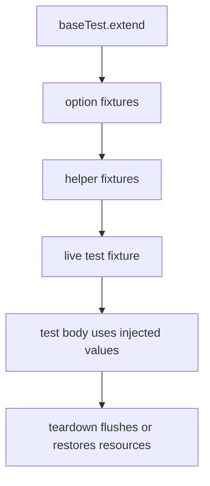

Fixture composition is the core abstraction that makes Playwright Labs feel consistent. Most packages export a Playwright `test` built with `baseTest.extend(...)`, an `expect` extended with package-specific matchers, and a small `Fixture` type that describes what gets injected into a test.

## What It Is and Why It Exists

The goal is to add one concern at a time without forcing a new runner. `fixture-sql` injects a managed `sql` connection, `fixture-otel` injects metric and span factories, `fixture-env` injects environment helpers, and `fixture-testcontainers` injects Docker container helpers. Because they all preserve Playwright’s shape, you can compose them with `mergeTests` and `mergeExpects`.

## How It Relates to Other Concepts

- Reporter packages consume data produced by fixtures, especially in the OTel family.
- Selector packages also export `test`, but their fixtures mostly register selector engines and return locator wrappers.
- Decorators solve a related problem for class-based tests, but they still build on top of a Playwright `TestType`.

## How It Works Internally

The pattern shows up repeatedly in source:

- [`packages/fixture-sql/src/fixture.ts`](/workspace/home/playwright-labs/packages/fixture-sql/src/fixture.ts) defines an option fixture `sqlAdapter`, a helper `useSql`, and a live `sql` fixture that throws early when no adapter is configured.
- [`packages/fixture-otel/src/fixture.ts`](/workspace/home/playwright-labs/packages/fixture-otel/src/fixture.ts) tracks every created metric or span in arrays so teardown can flush or end them automatically.
- [`packages/fixture-env/src/fixture.ts`](/workspace/home/playwright-labs/packages/fixture-env/src/fixture.ts) snapshots `process.env`, mutates it during the test, and restores it afterward.
- [`packages/decorators/src/makeDecorators.ts`](/workspace/home/playwright-labs/packages/decorators/src/makeDecorators.ts) generalizes the pattern by creating decorator wrappers around any `TestType`.



## Basic Usage

```ts
import { test, expect } from "@playwright-labs/fixture-env";

test("overrides env for one test", async ({ setEnv, getEnvValueOrThrow }) => {
  setEnv({ API_BASE_URL: "https://staging.example.com" });
  expect(getEnvValueOrThrow("API_BASE_URL")).toBe("https://staging.example.com");
});
```

## Advanced Composition

```ts
import { mergeExpects, mergeTests } from "@playwright/test";
import {
  test as sqlTest,
  expect as sqlExpect,
} from "@playwright-labs/fixture-sql";
import {
  test as tcTest,
  expect as tcExpect,
} from "@playwright-labs/fixture-testcontainers";
import { sqliteAdapter } from "@playwright-labs/fixture-sql/sqlite";

export const test = mergeTests(sqlTest, tcTest);
export const expect = mergeExpects(sqlExpect, tcExpect);

test.use({ sqlAdapter: sqliteAdapter(":memory:") });
```

<Callout type="warn">Many fixture packages rely on teardown to keep state clean. If you create extra resources inside helper fixtures like `useSql()` or `useContainer()`, keep them within the test scope so teardown can still see and dispose them.</Callout>

<Accordions>
<Accordion title="Why fixtures are preferred over helper singletons">
Fixtures map directly to Playwright scopes, so resource ownership is explicit and deterministic. A singleton helper can hide whether state belongs to a worker, a single test, or the whole process. In this repo, packages such as `fixture-sql` and `fixture-otel` deliberately keep created clients and metrics in per-test arrays so teardown can close or flush exactly what the test created. That is harder to do correctly with shared module state.
</Accordion>
<Accordion title="Trade-off: composition is flexible, but setup order matters">
Composing `mergeTests` is powerful because packages stay decoupled, but it also means the final test surface depends on import order and local conventions. For example, `fixture-sql` expects `test.use({ sqlAdapter })` to be configured before `sql` is resolved, and selector fixtures expect their engines to be registered in the worker before you use their shorthand helpers. The repo accepts this trade-off because it keeps each package independently installable. When building an internal base test, centralize those `test.use` calls in one file.
</Accordion>
</Accordions>
