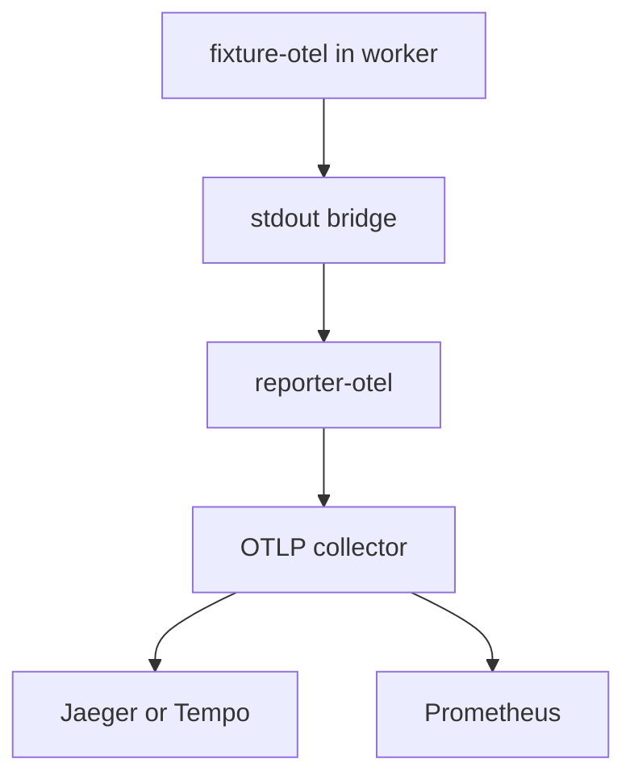

Use this guide when you want Playwright tests to emit spans and metrics to Jaeger, Tempo, Prometheus, or any OTLP-compatible collector.

<Steps>
<Step>

### Install the packages

```bash
pnpm add -D @playwright/test @playwright-labs/reporter-otel @playwright-labs/fixture-otel
```

</Step>
<Step>

### Configure the reporter

The example repo at [`examples/otel-stack/playwright.config.ts`](/workspace/home/playwright-labs/examples/otel-stack/playwright.config.ts) uses the reporter in the main process and points it at an OTLP/HTTP collector:

```ts
import { defineConfig } from "@playwright/test";

export default defineConfig({
  reporter: [
    ["list"],
    [
      "@playwright-labs/reporter-otel",
      {
        host: "localhost",
        port: 4318,
        exportIntervalMillis: 5_000,
        resourceAttributes: {
          "deployment.environment": "local",
        },
      },
    ],
  ],
});
```

</Step>
<Step>

### Emit custom metrics and spans in tests

```ts
import { test, expect, withSpan } from "@playwright-labs/fixture-otel";

test("checkout flow", async ({ useCounter, useHistogram, useTraceparent }) => {
  const { traceparent } = useTraceparent();
  const requests = useCounter("checkout_requests_total", { unit: "requests" });
  const duration = useHistogram("checkout_duration_ms", { unit: "ms" });

  await withSpan("checkout.validate-cart", async (span) => {
    span.setAttribute("traceparent", traceparent);
    requests.add(1, { stage: "validate-cart" });
    duration.record(120);
  });

  expect(requests).toHaveOtelCallCount(1);
});
```

</Step>
<Step>

### Verify the data path

The repo’s OTel example proves the full path by generating telemetry in one Playwright project and validating it in another. The generated stack is documented in [`examples/otel-stack/README.md`](/workspace/home/playwright-labs/examples/otel-stack/README.md).



</Step>
</Steps>

<Callout type="info">If you also call `startWorkerSdk()` from `@playwright-labs/otel-core`, auto-instrumented HTTP clients in the worker can reuse the active trace context created by `useTraceparent()`.</Callout>
