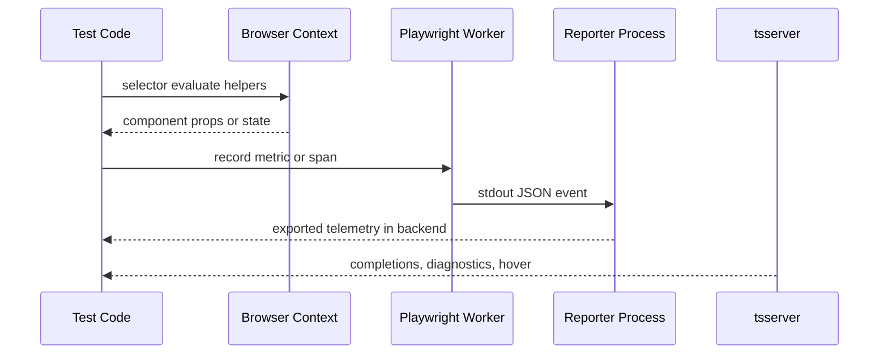

Several Playwright Labs packages do more than wrap Playwright APIs. They inspect runtime internals in the browser, transport structured events from workers to reporters, or plug into the TypeScript language service. The common idea is the same: keep the package boundary small, then move logic to the runtime that actually has the necessary context.

## What It Is and Why It Exists

React, Vue, Angular, OpenTelemetry, and tsserver all expose useful internals, but not from the same process. Browser frameworks can only be inspected in the page context. Reporter-level exporters should run in the main process. Editor completions can only come from the TypeScript language service. Playwright Labs packages place code where those internals are available and then bridge the result back into a stable public API.

## How It Relates to Other Concepts

- Fixture composition gives these packages a friendly surface in tests.
- The architecture split between worker and reporter is most visible in `fixture-otel` and `reporter-otel`.
- The selector packages rely on `selectors-core` for parsing, even when they have to inline the parser for browser serialization.

## How It Works Internally

- [`packages/selectors-react/src/engine.ts`](/workspace/home/playwright-labs/packages/selectors-react/src/engine.ts) and [`packages/selectors-vue/src/engine.ts`](/workspace/home/playwright-labs/packages/selectors-vue/src/engine.ts) inline `parseAttributeSelector` so Playwright can serialize the factory and run it in the browser.
- [`packages/selectors-angular/src/fixture.ts`](/workspace/home/playwright-labs/packages/selectors-angular/src/fixture.ts) builds self-contained `new Function(...)` wrappers that inject `window.ng`.
- [`packages/otel-core/src/events.ts`](/workspace/home/playwright-labs/packages/otel-core/src/events.ts) prefixes JSON lines with `__pw_otel__` so the reporter can distinguish telemetry payloads from ordinary stdout.
- [`packages/ts-plugin-sql/src/plugin.ts`](/workspace/home/playwright-labs/packages/ts-plugin-sql/src/plugin.ts) decorates the existing TypeScript `LanguageService` instead of replacing it.



## Basic Usage

```ts
import { test, expect } from "@playwright-labs/selectors-react";

test("reads a component prop", async ({ page, $r }) => {
  await page.goto("/");
  await expect(page.locator("react=Button")).toBeVisible();
  await expect(await $r("react=Button").first().prop("label")).toBe("Submit");
});
```

## Advanced Usage

```ts
import { test, withSpan } from "@playwright-labs/fixture-otel";

test("creates nested spans under one propagated trace", async ({ useTraceparent }) => {
  const { traceparent } = useTraceparent();

  await withSpan("checkout.flow", async (span) => {
    span.setAttribute("traceparent", traceparent);
    await withSpan("checkout.db", async () => {});
    await withSpan("checkout.payment", async () => {});
  });
});
```

<Callout type="warn">Selector packages depend on framework debug internals. `selectors-angular` explicitly throws when `window.ng` is unavailable, and React or Vue introspection can degrade in stripped production builds. Use them against development builds or purpose-built debug environments.</Callout>

<Accordions>
<Accordion title="Trade-off: self-contained browser functions duplicate logic">
The React and Vue selector engines duplicate parser helpers inside the engine factory even though `selectors-core` already exports them. That duplication is deliberate: Playwright serializes selector factories to strings, so imported Node helpers would disappear in the browser. The code is slightly harder to maintain, but the runtime behavior is reliable. The repo compensates by keeping the shared parser small and stable.
</Accordion>
<Accordion title="Trade-off: stdout is a simple transport, not a rich protocol">
The OTel family transports worker events over stdout because every Playwright worker already has that channel. This avoids standing up another IPC layer, but it means payloads must stay line-oriented and compact. `otel-core` solves this with a strict prefix and JSON schema, while `reporter-otel` buffers spans until test end so it can add metadata from annotations. The result is pragmatic and portable, but it is intentionally not a general-purpose RPC system.
</Accordion>
</Accordions>
