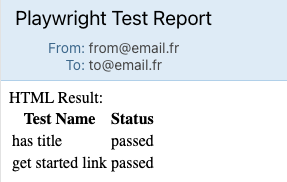

# Playwright email Reporter

This is a Playwright plugin that sends email reports after test runs using nodemailer.

## Installation

To install the Playwright Email Reporter plugin, run the following command:

```bash
npm install @playwright-labs/reporter-email # npm
yarn add @playwright-labs/reporter-email # yarn
pnpm add @playwright-labs/reporter-email # pnpm
```

## Usage

To use the Playwright Email Reporter plugin, add it to your Playwright configuration file:

```ts
import { defineConfig } from "@playwright/test";
import { type ReporterOptions } from "@playwright-labs/reporter-email";

export default defineConfig({
  reporter: [
    [
      "@playwright-labs/reporter-email",
      {
        from: "your-email@example.com",
        to: "recipient-email@example.com",
        subject: "Playwright Test Report",
        html: "<p>Test report</p>",
      } satisfies ReporterOptions,
    ],
  ],
});
```

## Reporter Options

- `send`: `'always' | 'on-failure' | 'on-success' | 'never'`. Default is `'on-failure'`
- `from`: string. Who sends the email. Default is `process.env.PLAYWRIGHT_EMAIL_FROM` or `playwright@reporter.com`
- `to`: string | string[]. Default is `process.env.PLAYWRIGHT_EMAIL_TO` or `playwright@reporter.com`
- `subject`: string | ((result: TestResult) => string). Subject of the email. Default is `process.env.PLAYWRIGHT_EMAIL_SUBJECT` or `Playwright Test Report`
- `html`: string | ((result: TestResult) => string)

## Dynamic message (depends on the test results)

```ts
import { defineConfig } from "@playwright/test";
import {
  type ReporterOptions,
  type TestCases,
} from "@playwright-labs/reporter-email";

function formatTable(result: TestResult, testCases: TestCases) {
  const str = Object.values(testCases).forEach((testCase) => {
    return `<tr><td>${testCase.test.name}</td><td>${testCase.result.status}</td></tr>`;
  });
  return `<table>${str}</table>`;
}

export default defineConfig({
  reporter: [
    [
      "@playwright-labs/reporter-email",
      {
        send: "always",
        from: "your-email@example.com",
        to: "recipient-email@example.com",
        subject: (result) =>
          `Playwright Test Report - ${result.status === "success" ? "Success" : "Failure"}`,
        html: (result, testCases) =>
          `<p>Test report for ${formatTable(result, testCases)}</p>`,
      } satisfies ReporterOptions,
    ],
  ],
});
```

## HTML Templates

Example of using html templates

You are available next tags:

- `h` - general element creator function
- `fragment` - fragment that allows to combine several elements without array usage.
- `div`
- `a`
- `img`
- `br`
- `hr`
- `ul`
- `li`
- `table`
- `thead`
- `tbody`
- `tr`
- `td`
- `th`

```ts
import {
  div,
  h1,
  p,
  table,
  thead,
  tbody,
  tr,
  td,
  fragment,
} from "@playwright-labs/reporter-email";

export default defineConfig({
  reporter: [
    [
      "@playwright-labs/reporter-email",
      {
        send: "always",
        from: "your-email@example.com",
        to: "recipient-email@example.com",
        subject: (result) =>
          `Playwright Test Report - ${result.status === "success" ? "Success" : "Failure"}`,
        html: (result, testCases) =>
          div(
            fragment(
              h1(
                `Playwright Test Report - ${result.status === "success" ? "Success" : "Failure"}`,
              ),
              p(`Test report table`),
              table(
                fragment(
                  thead(
                    tr(fragment(td("Test Name"), td("Status"), td("Duration"))),
                  ),
                  tbody(
                    testCases.map((testCase) =>
                      tr(
                        fragment(
                          td(testCase.title),
                          td(testCase.status),
                          td(testCase.duration),
                        ),
                      ),
                    ),
                  ),
                ),
              ),
            ),
          ),
      } satisfies ReporterOptions,
    ],
  ],
});
```

## Working with attachments

To attach files to the email, you can use the `attachments` option:

```ts
import { defineConfig } from "@playwright/test";
import {
  type ReporterOptions,
  type TestCases,
} from "@playwright-labs/reporter-email";

export default defineConfig({
  reporter: [
    [
      "@playwright-labs/reporter-email",
      {
        send: "always",
        from: "your-email@example.com",
        to: "recipient-email@example.com",
        subject: (result) => `Playwright Test Report for ${result.status}`,
        html: (result, testCases: TestCases) =>
          `<p>Test report for #${Object.values(testCases).length} tests</p>`,
        attachments: [
          {
            path: "path/to/file",
            name: "file.txt",
          },
        ],
      } satisfies ReporterOptions,
    ],
  ],
});
```

Example with [maildev](https://github.com/maildev/maildev?tab=readme-ov-file#docker-run) local service:

```ts
import { defineConfig } from "@playwright/test";
import { type ReporterOptions } from "@playwright-labs/reporter-email";

export default defineConfig({
  reporter: [
    [
      "@playwright-labs/reporter-email",
      {
        send: "always",
        service: "Maildev",
        port: 1025,
        from: "from@email.fr",
        to: "to@email.fr",
        subject: "Playwright Test Report",
        html: (result, testCases) => {
          return `
          HTML Result:
          <table>
            <tr>
              <th>Test Name</th>
              <th>Status</th>
            </tr>
            ${testCases
              .map(
                ([testCase, result]) => `
              <tr>
                <td>${testCase.title}</td>
                <td>${result.status}</td>
              </tr>
            `,
              )
              .join("")}
          </table>
          `;
        },
      } satisfies ReporterOptions,
    ],
  ],
});
```

Result of test report from maildev UI (http://localhost:1080): 

Example with an image [attachment](https://nodemailer.com/message/attachments):

```ts
import { defineConfig } from "@playwright/test";
import { type ReporterOptions } from "@playwright-labs/reporter-email";

export default defineConfig({
  reporter: [
    [
      "@playwright-labs/reporter-email",
      {
        send: "always",
        from: "your-email@example.com",
        to: "recipient-email@example.com",
        subject: (result) => `Playwright Test Report for ${result.testId}`,
        html: (result) => `<p>Test report for ${result.testId}</p>
        `,
        attachments: [
          {
            path: "path/to/file",
            name: "file.txt",
          },
          {
            path: "path/to/image.png",
            name: "image.png",
            contentType: "image/png",
          },
        ],
      } satisfies ReporterOptions,
    ],
  ],
});
```

## Services

All services are optional and reused from nodemailer. [See the docs of supported services](https://nodemailer.com/smtp/well-known-services#list-of-builtin-services).

| Service               | ID Provider                      | SMTP host                               | Port |
| --------------------- | -------------------------------- | --------------------------------------- | ---- |
| 1und1                 | 1&1 IONOS                        | smtp.1und1.de                           | 465  |
| 126                   | 126 Mail                         | smtp.126.com                            | 465  |
| 163                   | 163 Mail                         | smtp.163.com                            | 465  |
| Aliyun                | Alibaba Cloud (Aliyun)           | smtp.aliyun.com                         | 465  |
| AliyunQiye            | Alibaba Cloud Enterprise         | smtp.qiye.aliyun.com                    | 465  |
| AOL                   | AOL Mail                         | smtp.aol.com                            | 587  |
| Bluewin               | Swisscom Bluewin                 | smtpauths.bluewin.ch                    | 465  |
| DebugMail             | DebugMail.io                     | debugmail.io                            | 25   |
| DynectEmail           | Oracle Dynect Email              | smtp.dynect.net                         | 25   |
| Ethereal              | Ethereal Email (test)            | smtp.ethereal.email                     | 587  |
| FastMail              | FastMail                         | smtp.fastmail.com                       | 465  |
| Feishu                | Mail Feishu Mail                 | smtp.feishu.cn                          | 465  |
| Forward               | Email Forward Email              | smtp.forwardemail.net                   | 465  |
| GandiMail             | Gandi Mail                       | mail.gandi.net                          | 587  |
| Gmail                 | Gmail / Google Workspace         | smtp.gmail.com                          | 465  |
| Godaddy               | GoDaddy (US)                     | smtpout.secureserver.net                | 25   |
| GodaddyAsia           | GoDaddy (Asia)                   | smtp.asia.secureserver.net              | 25   |
| GodaddyEurope         | GoDaddy (Europe)                 | smtp.europe.secureserver.net            | 25   |
| hot.ee                | Hot.ee                           | mail.hot.ee                             | 25   |
| Hotmail               | Microsoft Outlook / Hotmail      | smtp-mail.outlook.com                   | 587  |
| iCloud                | Apple iCloud Mail                | smtp.mail.me.com                        | 587  |
| Infomaniak            | Infomaniak Mail                  | mail.infomaniak.com                     | 587  |
| Loopia                | Loopia                           | mailcluster.loopia.se                   | 465  |
| mail.ee               | Mail.ee                          | smtp.mail.ee                            | 25   |
| Mail.ru               | Mail.ru                          | smtp.mail.ru                            | 465  |
| Mailcatch.app         | Mailcatch.app (sandbox)          | sandbox-smtp.mailcatch.app              | 2525 |
| Maildev               | Maildev (local)                  | 127.0.0.1                               | 1025 |
| Mailgun               | Mailgun                          | smtp.mailgun.org                        | 465  |
| Mailjet               | Mailjet                          | in.mailjet.com                          | 587  |
| Mailosaur             | Mailosaur                        | mailosaur.io                            | 25   |
| Mailtrap              | Mailtrap                         | live.smtp.mailtrap.io                   | 587  |
| Mandrill              | Mandrill                         | smtp.mandrillapp.com                    | 587  |
| Naver                 | Naver                            | smtp.naver.com                          | 587  |
| One                   | one.com                          | send.one.com                            | 465  |
| OpenMailBox           | OpenMailBox                      | smtp.openmailbox.org                    | 465  |
| OhMySMTP              | OhMySMTP                         | smtp.ohmysmtp.com                       | 587  |
| Outlook365            | Microsoft 365 / Outlook 365      | smtp.office365.com                      | 587  |
| Postmark              | Postmark                         | smtp.postmarkapp.com                    | 2525 |
| Proton                | Proton Mail                      | smtp.protonmail.ch                      | 587  |
| qiye.aliyun           | Aliyun Enterprise (mxhichina)    | smtp.mxhichina.com                      | 465  |
| QQ                    | QQ Mail                          | smtp.qq.com                             | 465  |
| QQex                  | QQ Enterprise Mail               | smtp.exmail.qq.com                      | 465  |
| SendCloud             | SendCloud                        | smtp.sendcloud.net                      | 2525 |
| SendGrid              | SendGrid                         | smtp.sendgrid.net                       | 587  |
| SendinBlue            | Brevo (formerly Sendinblue)      | smtp-relay.brevo.com                    | 587  |
| SendPulse             | SendPulse                        | smtp-pulse.com                          | 465  |
| SES                   | AWS SES (generic)                | email-smtp.us-east-1.amazonaws.com      | 465  |
| SES-US-EAST-1         | AWS SES US East (N. Virginia)    | email-smtp.us-east-1.amazonaws.com      | 465  |
| SES-US-WEST-2         | AWS SES US West (Oregon)         | email-smtp.us-west-2.amazonaws.com      | 465  |
| SES-EU-WEST-1         | AWS SES EU West (Ireland)        | email-smtp.eu-west-1.amazonaws.com      | 465  |
| SES-AP-SOUTH-1        | AWS SES Asia Pacific (Mumbai)    | email-smtp.ap-south-1.amazonaws.com     | 465  |
| SES-AP-NORTHEAST-1    | AWS SES Asia Pacific (Tokyo)     | email-smtp.ap-northeast-1.amazonaws.com | 465  |
| SES-AP-NORTHEAST-2    | AWS SES Asia Pacific (Seoul)     | email-smtp.ap-northeast-2.amazonaws.com | 465  |
| SES-AP-NORTHEAST-3    | AWS SES Asia Pacific (Osaka)     | email-smtp.ap-northeast-3.amazonaws.com | 465  |
| SES-AP-SOUTHEAST-1    | AWS SES Asia Pacific (Singapore) | email-smtp.ap-southeast-1.amazonaws.com | 465  |
| SES-AP-SOUTHEAST-2AWS | SES Asia Pacific (Sydney)        | email-smtp.ap-southeast-2.amazonaws.com | 465  |
| Seznam                | Seznam.cz                        | Email smtp.seznam.cz                    | 465  |
| Sparkpost             | SparkPost                        | smtp.sparkpostmail.com                  | 587  |
| Tipimail              | Tipimail                         | smtp.tipimail.com                       | 587  |
| Yahoo                 | Yahoo Mail                       | smtp.mail.yahoo.com                     | 465  |
| Yandex                | Yandex Mail                      | smtp.yandex.ru                          | 465  |
| Zoho                  | Zoho Mail                        | smtp.zoho.com                           | 465  |

## API reference

### type TestCases

Array<[test: TestCase, result: TestResult]>

Where `value` is an array with 2 keys.

- `0` - `TestCase` - [TestCase](https://playwright.dev/docs/api/class-testcase) Object from Playwright.
- `1` - `TestResult` - [TestResult](https://playwright.dev/docs/api/class-testresult) Object from Playwright.

### type ReporterOptions

Options for the email reporter.

- `send` (optional) - `"always" | "never" | "on-failure"` - When to send email. Default is `"on-failure"`
- `from` (required) - `string` - Sender email address.
- `to` (required) - `string` - Recipient email address.
- `subject` (required) - `string` - Email subject.
- `html` (optional, required if no `text`) - `string` - HTML body.
- `text` (optional, required if no `html`) - `string` - Text body. Recommended to use `html` instead of `text`
- `cc` (optional) - `string` - Recipient email address.
- `bcc` (optional) - `string` - Recipient email address.
- `attachments` (optional) - `Attachment[]` - Array of attachments.

### type Attachment

Described at [nodemailer attachment docs](https://nodemailer.com/message/attachments/)

Can be either a file path or a buffer.

- `filename` - `string` - Path to the file to attach.
- `content` - `string` - Content of the attachment. `string` or `Buffer`
- `contentType` - `string` - MIME type of the attachment. Example: `application/octet-stream`

- `href` - `string` - URL of the attachment. `content` field is optional in this case.
